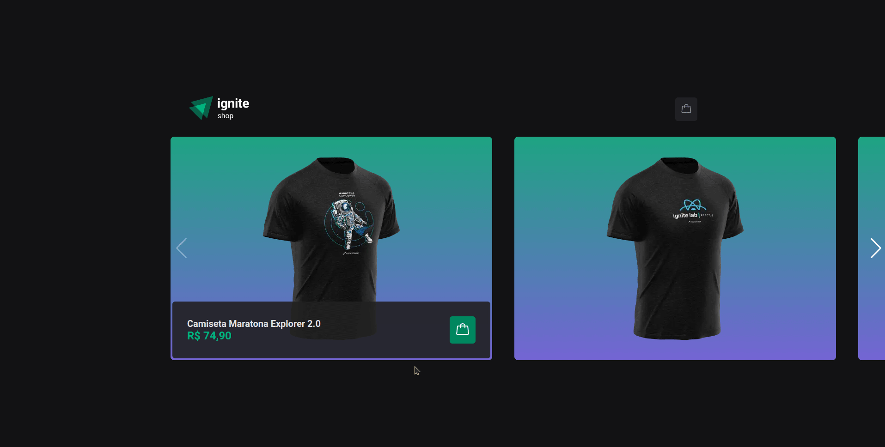

<span align="center">
  
</span>

<span align="center">
  
</span>

## 💻 Project

The Ignite Shop is a web application for selling t-shirts with themes from the dev world, showing in detail the visual and informational part of the t-shirts, in addition to presenting a cart where the customer can add his purchases and finalize his order through payment With credit card.

</br>
</br>

## ⚙ Technologies
This project was developed with the following technologies:

- [NextJs](https://nextjs.org/)
- [TypeScript](https://www.typescriptlang.org/)
- [Stitches](https://stitches.dev/)
- [Stripe](https://stripe.com/br)
- [Stripe](https://stripe.com/br)
- [Swiperjs](https://swiperjs.com/)
- [Swiperjs](https://swiperjs.com/)
- [Useshoppingcart](https://useshoppingcart.com/docs)
- [Axios](https://github.com/axios/axios)
- [Radix](https://www.radix-ui.com/)

## 👷 How to run 🚀

Install the dependencies of each project:
```bash
# Install the dependencies
$ npm i
# set environment variables in .env following .env.exemple
# Start the project
$ npm run dev
```

## 🔖 Layout

- [Figma](https://www.figma.com/file/Eu0KB594bgD757OnIdvR3K/Ignite-Shop-2.0-(Copy)?t=rzqmGcT7JhLjqRId-0)

## 📝 License

- [LICENSE](License.md).